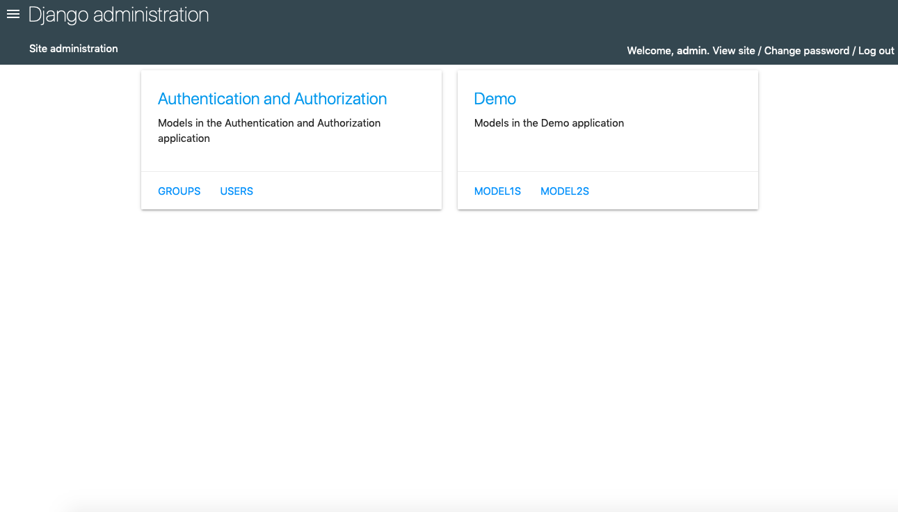
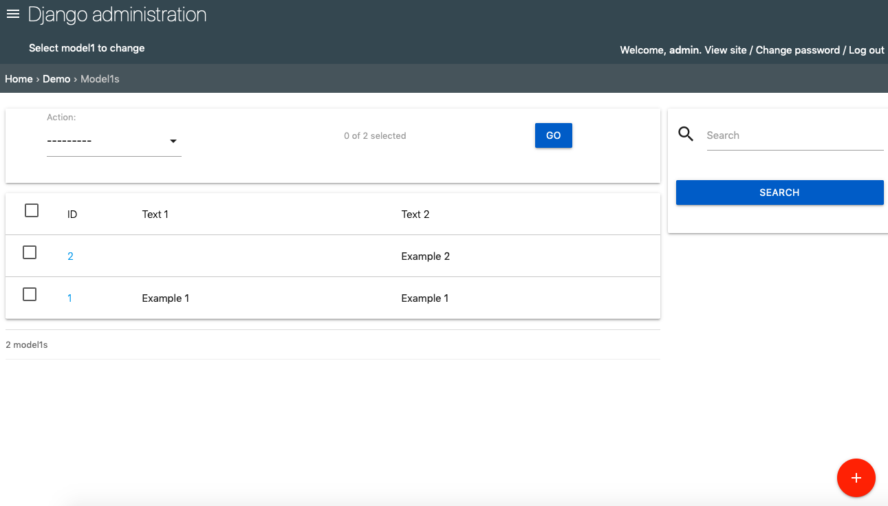
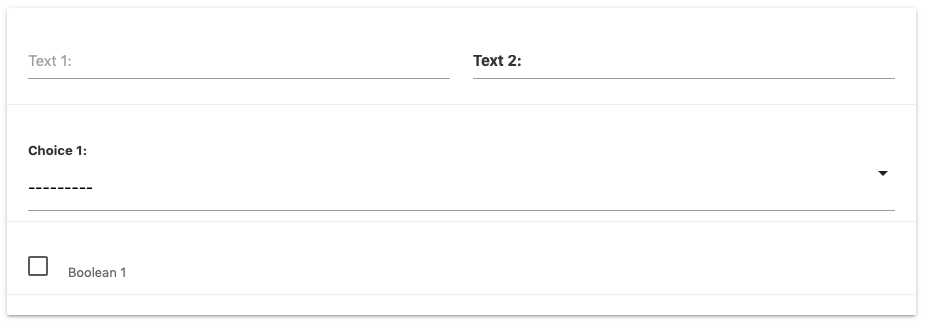
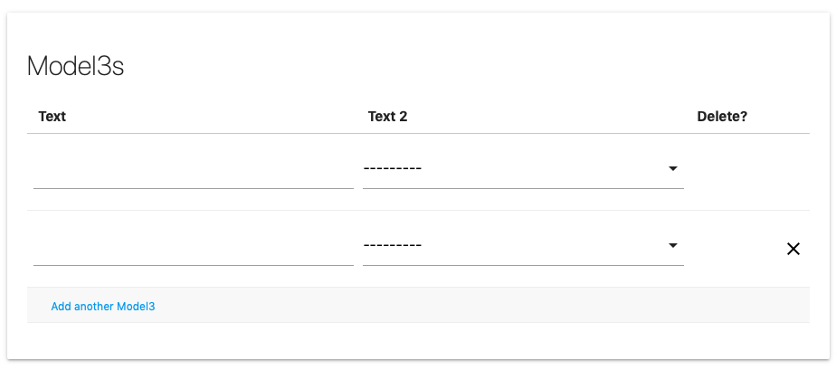

===============
django-admin-material
===============

django-admin-material is a different style for Django Admin.
It is based on Material Design by Google https://material.io

The framework used is Materialize CSS https://materializecss.com

Installation
-----------

1. Add "django_admin_material" to your INSTALLED_APPS setting like this::

    INSTALLED_APPS = [
        ...
        'django_admin_material',
    ]

It should be as high as possible, definetly higher than 'django.contrib.admin'

Demo
-----------

1. Download/clone this repository
2. Run (possibly in a virtual environment)::

    pip install -r requirements.txt

3. Run::

    ./reset_db.sh

It will install the necessary migration and fixtures

4. Run::

    python3 manage.py runserver

5. Visit http://localhost:8000/admin
6. Log in using "admin:admin"

Examples
-----------

